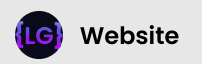
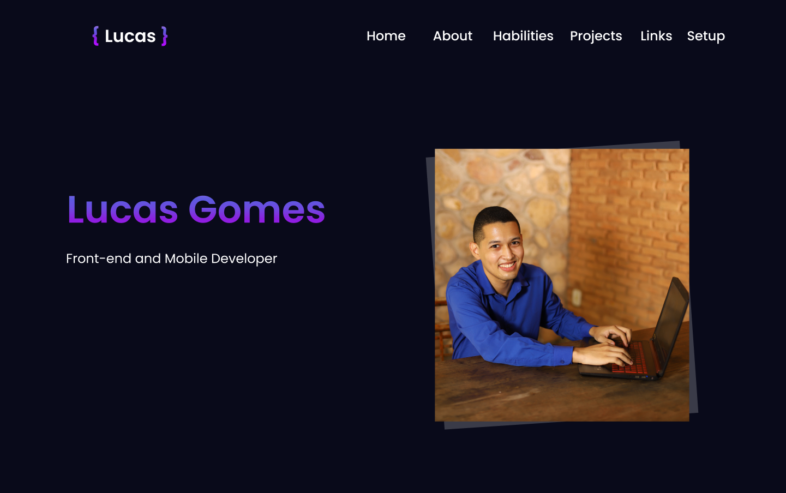

<div align="center">
     
</div>

---

<div align="center">
    
</div>

---
## :art: Layout
[Figma](https://www.figma.com/)

---
## :gear: Techs
- [NextJS](https://nextjs.org/)
- [ReactJS](https://reactjs.org/)
- [Styled Components](https://styled-components.com/)
- [Framer Motion](https://www.framer.com/motion/)

---
## :desktop_computer: How to use

Just download or make a git clone and run the command below in the project root folder

```
    yarn dev
```
---
## :spiral_notepad: License
Arquivos sob a licença [MIT](https://github.com/lucasgomesgp) criado por Lucas Gomes.